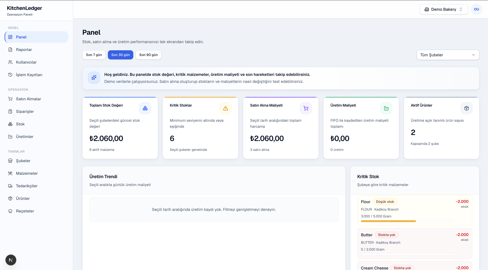
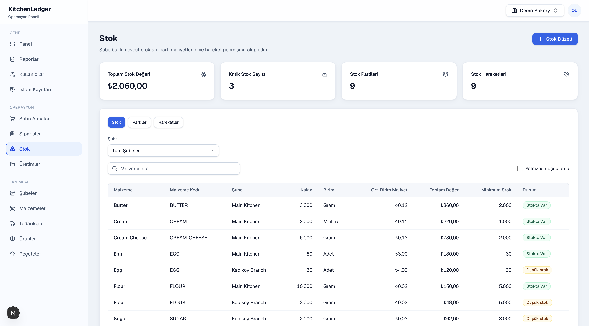
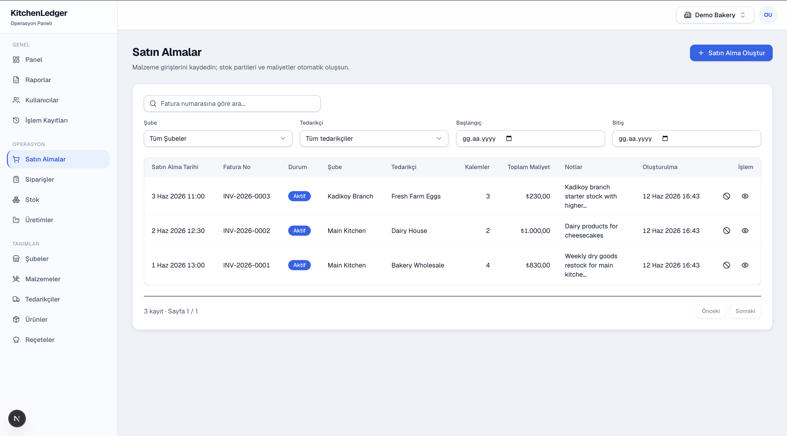
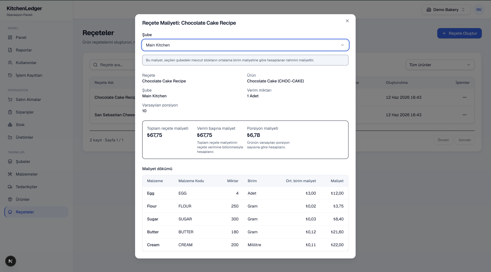
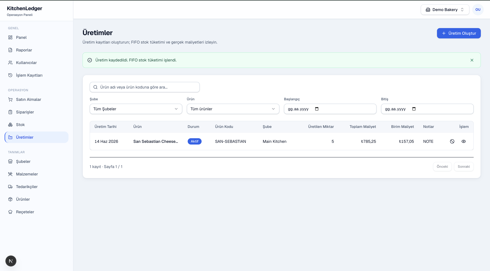
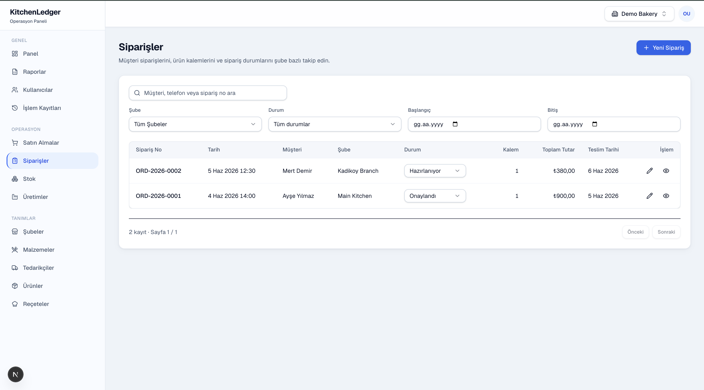
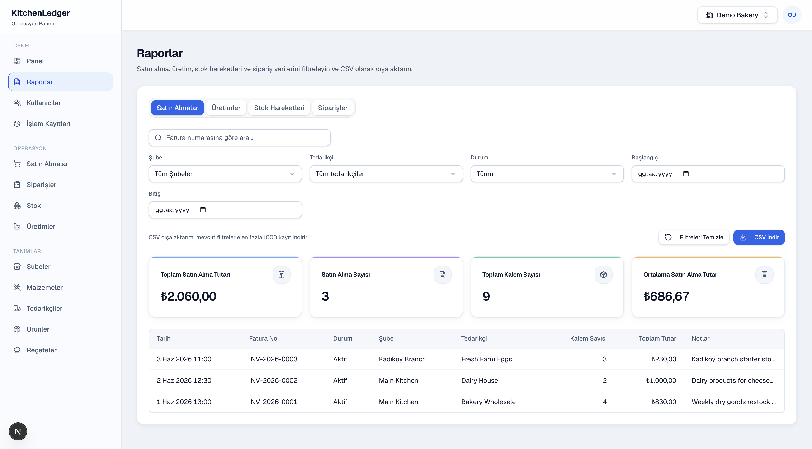
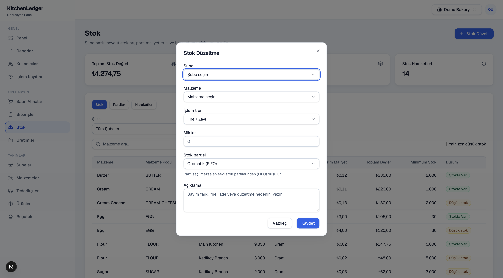
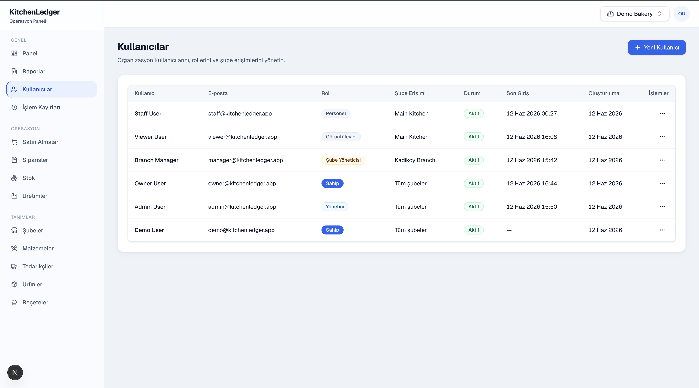
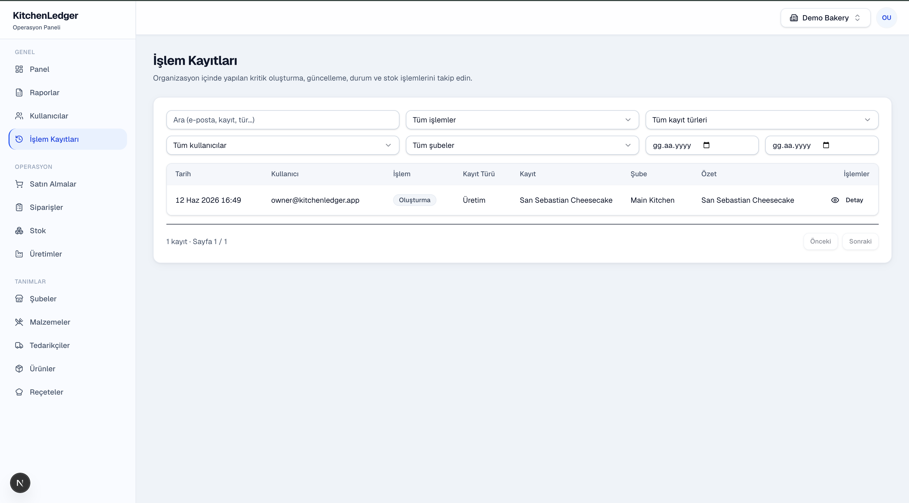

# KitchenLedger

## Türkçe

KitchenLedger, küçük üretim işletmeleri için geliştirilmiş full-stack ve çok kiracılı bir SaaS uygulamasıdır. Malzeme stoku, tedarikçi satın almaları, reçete maliyeti, FIFO üretim tüketimi, müşteri siparişleri, stok düzeltmeleri, raporlar, ekip yetkileri ve işlem kayıtları gibi temel işletme süreçlerini yönetir.

Uygulama; organizasyon ve şube bazlı çalışma, rol tabanlı yetkilendirme, stok hareket geçmişi, güvenli iptal akışları ve kullanıcı bazlı işlem takibi üzerine kuruludur.

## English

KitchenLedger is a full-stack multi-tenant SaaS application built for small food-production businesses. It manages ingredient inventory, supplier purchases, recipe costing, FIFO-based production consumption, customer orders, stock adjustments, reports, team permissions and activity logs.

The application is built around organization and branch-based workflows, role-based authorization, inventory movement history, safe cancellation flows and user-based activity tracking.

**Stack:** TypeScript · Next.js · NestJS · PostgreSQL

## Live Demo

This project is not currently deployed. It can be run locally with the included seed data.

Demo credentials are listed in [Demo Credentials](#demo-credentials) below. For a guided walkthrough, see [docs/DEMO.md](docs/DEMO.md).

## Overview

### Problem

Small bakeries, cafes and boutique food producers often lack visibility into true product cost. Supplier prices vary, stock is tracked informally, and multi-branch operations make it hard to see where margin is lost.

### Solution

KitchenLedger connects purchasing, inventory, recipe costing and production into one operational system. Purchases create stock batches, recipes estimate branch-specific costs, and production runs consume stock via FIFO with immutable cost snapshots.

### Target Users

- Small bakeries and patisseries
- Cafes with in-house production
- Boutique food producers with multiple branches
- Operators who need ingredient-level cost control without enterprise ERP complexity

## Core Features

- Multi-tenant organization and branch management
- Role and branch-based authorization (OWNER, ADMIN, BRANCH_MANAGER, STAFF, VIEWER)
- Team management — invite users, assign roles and branch access (OWNER/ADMIN)
- Owner-only audit logs for critical mutations
- Ingredient, supplier, product and recipe management
- Purchase-based stock batches with automatic movements
- Purchase cancellation / reversal (unconsumed batches only)
- Inventory stock summary, movement history and stock adjustments (waste, return, manual)
- Branch-specific recipe costing (weighted average preview)
- FIFO production consumption with immutable cost snapshots
- Production cancellation / FIFO stock restoration and reversal movements
- Customer orders with create, edit and status tracking (no stock side effects)
- Dashboard analytics (purchases, production, low stock, recent activity)
- Reports and CSV export (purchases, productions, stock movements, orders)
- Demo role users for local testing and QA scenarios

## Tech Stack

**Frontend**

- Next.js · TypeScript · Tailwind CSS · shadcn/ui
- TanStack Query · React Hook Form · Zod · Recharts

**Backend**

- NestJS · TypeScript · Prisma · PostgreSQL
- JWT auth · bcrypt · REST API

**Tooling**

- Turborepo · pnpm · ESLint · Prettier

## Architecture

```
apps/
  web/     # Next.js dashboard UI
  api/     # NestJS REST API
packages/
  db/      # Prisma schema, migrations, seed
  eslint-config/
  typescript-config/
```

See [docs/ARCHITECTURE.md](docs/ARCHITECTURE.md) for module boundaries, multi-tenant model and costing design.

## Main Business Flow

1. Create branches, suppliers and ingredients
2. Record purchases
3. Stock batches and purchase movements are created automatically
4. Create products and recipes
5. Calculate branch-specific recipe cost
6. Record production
7. FIFO stock batches are consumed
8. Production cost snapshot is stored
9. Dashboard and inventory reflect the changes

## Demo Credentials

After seeding, log in at http://localhost:3000/login.  
Password for all accounts: **`Password123!`**

| Role           | Email                       | Password       | Expected access                 |
| -------------- | --------------------------- | -------------- | ------------------------------- |
| Owner          | `owner@kitchenledger.app`   | `Password123!` | Full access (all branches)      |
| Admin          | `admin@kitchenledger.app`   | `Password123!` | Full organization access        |
| Branch Manager | `manager@kitchenledger.app` | `Password123!` | Kadikoy branch scope            |
| Staff          | `staff@kitchenledger.app`   | `Password123!` | Main Kitchen operational access |
| Viewer         | `viewer@kitchenledger.app`  | `Password123!` | Read-only Main Kitchen access   |

Legacy owner alias: `demo@kitchenledger.app` / `Password123!`

Full demo flow and role checklist: [docs/DEMO.md](docs/DEMO.md)

## Local Development

**Prerequisites:** Node.js 20+, pnpm 10+, PostgreSQL

```bash
pnpm install

cp apps/api/.env.example apps/api/.env
cp apps/web/.env.example apps/web/.env.local
# Set DATABASE_URL in apps/api/.env

pnpm db:generate
pnpm db:migrate
pnpm db:seed

pnpm dev
# API: http://localhost:3001
# Web: http://localhost:3000
```

| Command           | Description                        |
| ----------------- | ---------------------------------- |
| `pnpm build`      | Build all packages                 |
| `pnpm lint`       | Lint all packages                  |
| `pnpm typecheck`  | Type-check all packages            |
| `pnpm db:migrate` | Apply migrations (local dev)       |
| `pnpm db:deploy`  | Apply migrations (production)      |
| `pnpm db:seed`    | Seed demo data (demo/staging only) |
| `pnpm db:studio`  | Open Prisma Studio                 |

`pnpm db:seed` resets the demo organization — do not run automatically in production.

## Deployment

Deploy web (Vercel) and API (Railway/Render) separately with managed PostgreSQL.

See [docs/DEPLOYMENT.md](docs/DEPLOYMENT.md) for env variables, build/start commands, cookie/CORS setup and post-deploy checklist.

## Documentation

| Doc                                              | Description                         |
| ------------------------------------------------ | ----------------------------------- |
| [docs/DEMO.md](docs/DEMO.md)                     | Demo Guide — users, flows, roles    |
| [docs/ARCHITECTURE.md](docs/ARCHITECTURE.md)     | Architecture Notes                  |
| [docs/API_OVERVIEW.md](docs/API_OVERVIEW.md)     | API Overview                        |
| [docs/QA_CHECKLIST.md](docs/QA_CHECKLIST.md)     | QA Checklist (Turkish)              |
| [docs/DEPLOYMENT.md](docs/DEPLOYMENT.md)         | Deployment Guide                    |
| [docs/SCREENSHOTS.md](docs/SCREENSHOTS.md)       | Screenshot Guide (Turkish)          |
| [docs/PROJECT_STORY.md](docs/PROJECT_STORY.md)   | Project Story — product narrative   |

## Known MVP Limitations

- No customer portal, payment or invoice integration
- No email invite or password-reset flows
- No automated tests or CI/CD pipeline in this repository
- No unit conversion; ingredient `baseUnit` must match recipe/purchase units exactly
- No purchase or production direct edit; safe cancellation/reversal flows are implemented instead
- No advanced partial reversal or correction workflows beyond cancel flows
- Reports aggregate existing list APIs client-side (no dedicated analytics backend)
- Access token stored in `localStorage`; HttpOnly session pattern can be adopted later
- Advanced DB row locking for high-concurrency stock consumption is not implemented yet

## Screenshots

For the capture process and recommended screen states, see [docs/SCREENSHOTS.md](docs/SCREENSHOTS.md).

### Dashboard



### Inventory / Stok



### Purchases / Satın Almalar



### Recipe Costing / Reçete Maliyeti



### Productions / Üretimler



### Orders / Siparişler



### Reports / Raporlar



### Stock Adjustment / Stok Düzeltme



### Team Management / Kullanıcı Yönetimi



### Audit Logs / İşlem Kayıtları


